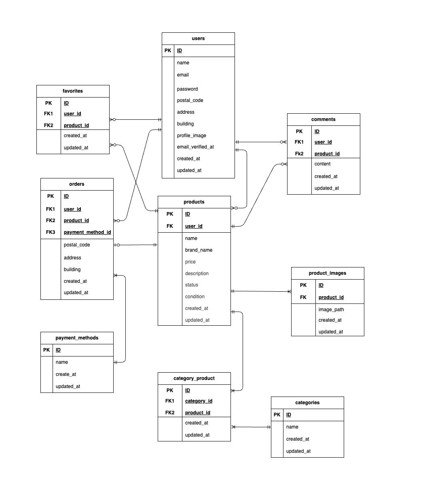

# coachtechフリマ

## 概要
coachtechフリマは、ユーザーが商品を出品・購入できるフリマアプリです。会員登録、ログイン、商品出品、購入、コメント、いいね機能を備えており、メール認証には Mailhog を使用しています。

## 環境構築
**Dockerビルド**
1. `git clone git@github.com:shiori-nampo/coachtech-flea-market.git`
2. DockerDesktopアプリを立ち上げる
3. `docker-compose up -d --build`

> *MacのM1・M2チップのPCの場合、`no matching manifest for linux/arm64/v8 in the manifest list entries`のメッセージが表示されビルドができないことがあります。
エラーが発生する場合は、docker-compose.ymlファイルの「mysql」内に「platform」の項目を追加で記載してください*
``` bash
mysql:
    platform: linux/x86_64
    image: mysql:8.0.26
    environment:
```

**Laravel環境構築**
1. `docker-compose exec php bash`
2. `composer install`
3. 「.env.example」ファイルを 「.env」ファイルに命名を変更。または、新しく.envファイルを作成
4. .envに以下の環境変数を追加
``` text
DB_CONNECTION=mysql
DB_HOST=mysql
DB_PORT=3306
DB_DATABASE=flea_db
DB_USERNAME=flea_user
DB_PASSWORD=flea_pass
```
5. アプリケーションキーの作成
```bash
php artisan key:generate
```

6. マイグレーションの実行
```bash
php artisan migrate
```

7. ストレージリンクの作成
```bash
php artisan storage:link
```

8. 初期データ投入
```bash
php artisan db:seed
```

9. Stripe PHPライブラリのインストール
```bash
composer require stripe/stripe-php
```

## 使用技術(実行環境)
- Docker / Docker Compose
- PHP8.1.33
- Laravel8.83.29
- MySQL8.0.44
- MailHog(メール認証用)


## ER図


## URL
- 開発環境:http://localhost:8000/
- phpMyAdmin:http://localhost:8080
- MailHog:http://localhost:8025

## メール認証(MailHog)
.envに以下を追加してください

MAIL_MAILER=smtp
MAIL_HOST=mailhog
MAIL_PORT=1025
MAIL_USERNAME=null
MAIL_PASSWORD=null
MAIL_ENCRYPTION=null
MAIL_FROM_ADDRESS=test@example.com
MAIL_FROM_NAME="coachtech-flea-market"

※ 認証メールは MailHog(http://localhost:8025)で確認できます。

## ログイン情報

### 管理者ユーザー
本アプリでは管理者ユーザーは存在せず、すべて一般ユーザーとして利用します。

動作確認は、新規ユーザー登録を行なってください。


### Stripeについて
コンビニ支払いとカード支払いのオプションがあります。<br>

StripeのAPIキーは以下のように設定をお願いいたします。
```
STRIPE_PUBLIC_KEY="パブリックキー"
STRIPE_SECRET_KEY="シークレットキー"
```


## 実装機能一覧
- ユーザー登録・ログイン機能（Laravel Fortify）
  - バリデーションはフォームリクエストで管理しています
- メール認証機能（MailHogを使用）
  - 開発環境では MailHog にて認証メールを確認できます
- 商品一覧表示・詳細表示
  - 未ログインユーザーでも閲覧可能です
- 商品出品機能（画像アップロード対応）
  - 商品名、価格、商品説明、カテゴリ、ブランド名を登録できます
  - ブランド名は2に項目で、未入力の場合は、NULL として保存されます
- 商品購入機能
  - 支払方法選択を選択して購入できます
  - カード決済はStripe（テスト環境）を使用しています
- コメント機能（ログインユーザーのみ投稿可）
  - ログインユーザーのみコメント投稿ができます
  - コメントは255文字以内で投稿できます
- いいね（お気に入り）機能
  - ログインユーザーが商品をお気に入り登録できます
- マイページ機能
  - 出品した商品の一覧を表示できます
  - 購入した商品の一覧を表示できます
- プロフィール編集機能
  - ユーザー名、住所情報、プロフィール画像を変更できます


## テーブル仕様
### usersテーブル
| カラム名 | 型 | primary key | unique key | not null | foreign key |
| --- | --- | --- | --- | --- | --- |
| id | bigint | ◯ |  | ◯ |  |
| name | varchar(100) |  |  | ◯ |  |
| email | varchar(100) |  | ◯ | ◯ |  |
| email_verified_at | timestamp |  |  |  |  |
| password | varchar(100) |  |  | ◯ |  |
| postal_code | string |  |  |  |  |
| address | string |  |  |  |  |
| building | string |  |  |  |  |
| profile_image | string |  |  |  |  |
| created_at | timestamp |  |  |  |  |
| updated_at | timestamp |  |  |  |  |

### categoriesテーブル
| カラム名 | 型 | primary key | unique key | not null | foreign key |
| --- | --- | --- | --- | --- | --- |
| id | bigint | ◯ |  | ◯ |  |
| name | vachar(100) |  |  | ◯ |  |
| created_at | timestamp |  |  |  |  |
| updated_at | timestamp |  |  |  |  |

### productsテーブル
| カラム名 | 型 | primary key | unique key | not null | foreign key |
| --- | --- | --- | --- | --- | --- |
| id | bigint | ◯ |  | ◯ |  |
| user_id | bigint |  |  | ◯ | users(id) |
| condition_id | bigint |  |  | ◯ | conditions(id) |
| name | varchar(100) |  |  | ◯ |  |
| price | integer |  |  | ◯ |  |
| brand_name | varchar(100) |  |  |  |  |
| description | text |  |  | ◯ |  |
| image | string |  |  | ◯ |  |
| status | vachar(50) |  |  | ◯ |  |
| created_at | timestamp |  |  |  |  |
| updated_at | timestamp |  |  |  |  |

### commentsテーブル
| カラム名 | 型 | primary key | unique key | not null | foreign key |
| --- | --- | --- | --- | --- | --- |
| id | bigint | ◯ |  | ◯ |  |
| user_id | bigint |  |  | ◯ | users(id) |
| item_id | bigint |  |  | ◯ | products(id) |
| content | string |  |  | ◯ |  |
| created_at | timestamp |  |  |  |  |
| updated_at | timestamp |  |  |  |  |

### favoritesテーブル
| カラム名 | 型 | primary key | unique key | not null | foreign key |
| --- | --- | --- | --- | --- | --- |
| user_id | bigint |  | ◯ | ◯ | users(id) |
| item_id | bigint |  | ◯ | ◯ | products(id) |
| created_at | timestamp |  |  |  |  |
| updated_at | timestamp |  |  |  |  |

### ordersテーブル
| カラム名 | 型 | primary key | unique key | not null | foreign key |
| --- | --- | --- | --- | --- | --- |
| id | bigint | ◯ |  | ◯ |  |
| user_id | bigint |  |  | ◯ | users(id) |
| product_id | bigint |  |  | ◯ | products(id) |
| payment_method_id | bigint |  |  | ◯ | payment_methods(id)|
| post_code | string |  |  | ◯ |  |
| address | string |  |  | ◯ |  |
| building | string |  |  |  |  |
| created_at | created_at |  |  |  |  |
| updated_at | updated_at |  |  |  |  |

### category_productsテーブル
| カラム名 | 型 | primary key | unique key | not null | foreign key |
| --- | --- | --- | --- | --- | --- |
| id | bigint | ◯ |  |  |  |
| product_id | bigint |  | ◯ | ◯ | products(id) |
| category_id | bigint |  | ◯ | ◯ | categories(id) |
| created_at | timestamp |  |  |  |  |
| updated_at | timestamp |  |  |  |  |

### payment_methodsテーブル
| カラム名 | 型 | primary key | unique key | not null | foreign key |
| --- | --- | --- | --- | --- | --- |
| id | bigint | ◯ |  | ◯ |  |
| name | vachar(100) |  | ◯ | ◯ |  |
| code | string |  |  |  |  |
| created_at | timestamp |  |  |  |  |
| updated_at | timestamp |  |  |  |  |

### conditionsテーブル
| カラム名 | 型 | primary key | unique key | not null | foreign key |
| --- | --- | --- | --- | --- | --- |
| id | bigint | ◯ |  | ◯ |  |
| name | varchar(100) |  |  | ◯ |  |
| created_at | timestamp |  |  |  |  |
| updated_at | timestamp |  |  |  |  |


## テストアカウント
name: 一般ユーザ  
email: test@user.com
password: coachtechtest  
-------------------------


## PHPUnitを利用したテストに関して
以下のコマンド:  
```
//テスト用データベースの作成
docker-compose exec mysql bash
mysql -u root -p
//パスワードはrootと入力
create database flea_db;
exit

docker-compose exec php bash
php artisan migrate:fresh --env=testing
./vendor/bin/phpunit
```
※.env.testingにもStripeのAPIキーを設定してください。  